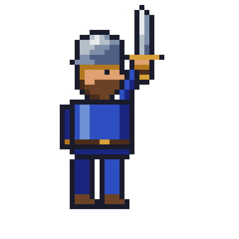
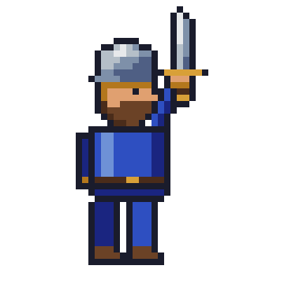
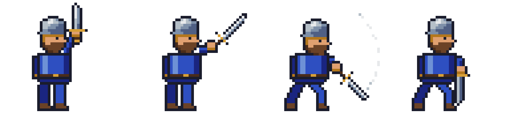

# Aseprite MCP Tools

A Python MCP server that gives AI assistants full control over [Aseprite](https://www.aseprite.org/) for creating pixel art and animated sprites.

**104 tools across 17 categories** — canvas, drawing, layers, animation, palettes, effects, slices, tilemaps, exports, visual-feedback/analysis tools, and a raw Lua escape hatch. The tool set is designed so an LLM has everything it needs to produce *good* pixel art, not just primitives: shading ramps with hue shifting, ordered dithering, outlines, retro palette presets with quantization, onion-skin renders, and frame diffing for animation work.

## Example: a swordsman, drawn and animated by Claude

<table>
  <tr>
    <td align="center"></td>
    <td align="center"></td>
  </tr>
  <tr>
    <td align="center"><sub><b>Task 1</b> — <em>"Draw me a pixel art of a swordsman."</em><br>32×32 still, exported at 10×.</sub></td>
    <td align="center"><sub><b>Task 2</b> — <em>"…a sword slash attack sequence, from windup to follow-through."</em><br>4-frame animation, exported with <code>export_tag</code>.</sub></td>
  </tr>
  <tr>
    <td align="center" colspan="2"></td>
  </tr>
  <tr>
    <td align="center" colspan="2"><sub>The same slash as a spritesheet (<code>export_spritesheet</code>): windup → extension → swing → follow-through.</sub></td>
  </tr>
</table>

Both were created end-to-end by Claude Fable 5 through this server's MCP tools — drawing, checking its own work with scaled `export_frame` previews and `render_onion_skin`, then exporting. The tasks recreate the benchmark from [Draw Me a Swordsman](https://ljvmiranda921.github.io/notebook/2025/07/20/draw-me-a-swordsman/) by Lj Miranda, whose findings inspired this server's expanded toolset.

## Tool Categories

| Category | Tools | Description |
|----------|------:|-------------|
| [Canvas](#canvas) | 6 | Create sprites, manage layers/frames, set the active state |
| [Drawing](#drawing) | 14 | Pixels, lines, rectangles, circles, ellipses, polygons, paths, fills, gradients |
| [Text](#text) | 3 | Draw and measure text with bitmap sprite-sheet or TrueType fonts |
| [Layers](#layers) | 7 | Delete, rename, duplicate, reorder, blend modes, merge, flatten |
| [Selection & Regions](#selection--regions) | 4 | Move, copy, and erase rectangular regions or colors |
| [Effects](#effects) | 5 | Outlines, color replacement, HSL adjustment, ordered dithering |
| [Animation](#animation) | 24 | Frames, cels, tags, tweening with easing, propagation |
| [Palette](#palette) | 8 | Get/set palettes, retro presets, color ramps, quantization, color modes |
| [Transform](#transform) | 4 | Flip, rotate, resize, crop |
| [Slices](#slices) | 5 | Named regions, 9-patch centers, pivot points |
| [Tilemap](#tilemap) | 5 | Tilemap layers, tileset editing, tile placement |
| [Export & Import](#export--import) | 7 | PNG, GIF, sprite sheets, per-layer/per-tag export, image import |
| [Inspection](#inspection) | 3 | Read pixels and sprite metadata |
| [Analysis & Visual Feedback](#analysis--visual-feedback) | 3 | Onion-skin renders, frame diffing, color statistics |
| [Quality](#quality) | 4 | Validate and sanitize animation consistency |
| [Scene](#scene) | 1 | Copy layers between sprite files |
| [Preview & Guide](#preview--guide) | 3 | Local HTTP preview server, workflow guide |
| [Scripting](#scripting) | 1 | Raw Lua escape hatch for anything not covered above |

### Canvas

| Tool | Description |
|------|-------------|
| `create_canvas` | Create a new sprite with the given dimensions |
| `add_layer` | Add a new layer, optionally inside a named group |
| `add_group` | Add a new (optionally nested) group layer |
| `add_frame` | Append a new frame |
| `set_frame` | Set the active frame |
| `set_frame_duration` | Set one frame's duration in ms |
| `set_layer` | Set the active layer (optionally creating it) |

### Drawing

All `_at` variants target a specific layer/frame and can create the cel on demand. Coordinates are sprite-global.

| Tool | Description |
|------|-------------|
| `draw_pixels` | Plot individual pixels with per-pixel colors |
| `draw_pixels_at` | Plot pixels on a specific layer/frame |
| `draw_line` / `draw_line_at` | Lines with thickness |
| `draw_rectangle` / `draw_rectangle_at` | Outlined or filled rectangles |
| `draw_circle` / `draw_circle_at` | Outlined or filled circles |
| `draw_ellipse_at` | Outlined or filled ellipses with separate x/y radii |
| `draw_polygon` | Outlined or filled polygons from a point list |
| `draw_path` | Polyline through a point list with thickness |
| `fill_area` / `fill_area_at` | Paint-bucket flood fill |
| `apply_gradient_rect` | Smooth linear gradient fill in a rectangle |

### Text

Aseprite's Lua API has no text drawing, so glyphs are rasterised on the server and composited into the sprite. Two font backends are supported: **bitmap** sprite-sheet fonts (the right choice for pixel art — glyphs are already pixels and `size` scales them by whole numbers) and **TrueType** `.ttf`/`.otf` files, rendered without antialiasing unless you ask for it.

Fonts are discovered in `~/.aseprite-mcp/fonts`: a bitmap font is a directory containing `font.json` plus its sheet PNGs; a TrueType font is just the font file. Installed system fonts are listed too. `font` also accepts a direct path.

| Tool | Description |
|------|-------------|
| `list_text_fonts` | List the bitmap and TrueType fonts available to `draw_text` |
| `measure_text` | Width, height, advance and baseline extents — size a panel or centre a label without redrawing to find out |
| `draw_text` | Draw text with anchors, faux bold, outline, drop shadow and letter spacing |

Call `measure_text` first when the layout depends on the text: it returns the same metrics `draw_text` will use, so a label can be centred or a plate sized in one pass.

```
measure_text(text="MODERATOR", font="minecraft", size=2, bold=1)
  -> width=115 height=15 advance_width=117 above_baseline=14 below_baseline=1 left_bearing=0

draw_text(filename="badge.aseprite", text="MODERATOR", x=64, y=17,
          font="minecraft", size=2, anchor="baseline", bold=1,
          color="#FFFFFF", shadow_color="#14237A")
```

Anchors are `topleft`/`top`/`topright`, `left`/`center`/`right`, `bottomleft`/`bottom`/`bottomright`, plus `baselineleft`/`baseline`/`baselineright` for pinning several labels to one baseline. Outline and shadow grow the stamp but never move the glyphs.

#### font.json

```json
{
  "name": "my-font",
  "letter_gap": 1,
  "space_width": 3,
  "sheets": [{
    "file": "sheet.png",
    "cell_w": 8, "cell_h": 8,
    "ascent": 7,
    "chars": [" !\"#$%&'()*+,-./", "0123456789:;<=>?"]
  }],
  "overrides": {
    "86": {"ascent": 7, "rows": ["#...#", "#...#", ".#.#.", "..#.."]}
  }
}
```

Each sheet carries its own `ascent`, so sheets with different cell sizes still share a baseline — that is how a compact ASCII sheet and a taller accented sheet combine into one run. `origin` shifts the cell grid when the sheet has a margin, `ink_rule: "dark"` reads sheets that use an opaque white background to delimit variable-width glyph boxes, and `advance: "box"` takes the advance from the box rather than the ink. `overrides` replaces individual glyphs with hand-drawn rows, which is useful when a sheet ships a glyph that is off-centre or too tall to sit on the line.

### Layers

| Tool | Description |
|------|-------------|
| `delete_layer` | Delete a layer by name |
| `rename_layer` | Rename a layer |
| `duplicate_layer` | Duplicate a layer with all cels, opacity, and blend mode, optionally into a group |
| `reorder_layer` | Move a layer to a position in the stack |
| `set_layer_blend_mode` | Set blend mode (multiply, screen, overlay, ... 19 modes) |
| `merge_layer_down` | Merge a layer into the one below it |
| `flatten_sprite` | Flatten all layers into one |

### Selection & Regions

| Tool | Description |
|------|-------------|
| `move_region` | Cut a rectangle of pixels and paste it elsewhere |
| `copy_region` | Copy a rectangle to another position, layer, or frame |
| `erase_region` | Make a rectangle transparent |
| `erase_color` | Magic-eraser: make all pixels of a color transparent (with tolerance) |

### Effects

The pixel-art toolbox: clean outlines, palette-respecting blends, and shading variants.

| Tool | Description |
|------|-------------|
| `outline_cel` | Add a 1px outline around all opaque pixels |
| `replace_color` | Replace one color with another (with tolerance), preserving alpha |
| `adjust_hsl` | Shift hue/saturation/lightness of a cel — palette swaps, night scenes, shadows |
| `apply_dither_gradient` | Two-color gradient using Bayer 4×4 ordered dithering |
| `apply_dither_pattern` | Uniform dithered mix of two colors at a given density |

### Animation

| Tool | Description |
|------|-------------|
| `add_frames` | Append N frames with optional duration |
| `delete_frame` | Delete a frame |
| `set_frame_duration_all` | Set every frame's duration |
| `duplicate_frame_range` | Duplicate a frame range N times |
| `copy_frame` / `propagate_frame_to_range` | Copy all cels of a frame to other frames |
| `create_cel` / `clear_cel` / `copy_cel` | Cel lifecycle on a layer/frame |
| `propagate_cels` | Copy selected layers' cels across a frame range |
| `set_cel_position` | Place a cel at x,y |
| `set_cel_opacity` | Set a single cel's opacity |
| `offset_cel_positions` | Shift cels by a delta across frames |
| `tween_cel_positions` | Linear position tween across frames |
| `tween_cel_positions_eased` | Position tween with easing (ease_in/out, smoothstep) |
| `tween_cel_opacity_eased` | Opacity tween with easing |
| `tween_cel_scale_eased` | Scale tween with easing and anchor |
| `oscillate_cel_positions` | Sine-wave motion (bobbing, breathing, hovering) |
| `set_tag` / `delete_tag` | Animation tags with direction (forward/reverse/pingpong) |
| `set_layer_visibility` / `set_layer_opacity` | Layer-level visibility and opacity |
| `set_onion_skin` | Configure onion-skin UI prefs (see `render_onion_skin` for batch use) |
| `get_sprite_info` | Sprite metadata: size, layers, frames, durations, tags |

### Palette

| Tool | Description |
|------|-------------|
| `get_palette` | Read the palette as hex colors |
| `set_palette` | Set the palette from a list of hex colors |
| `list_palette_presets` | List built-in retro palettes |
| `apply_palette_preset` | Apply a preset: `gameboy`, `pico8`, `c64`, `cga`, `dawnbringer16`, `dawnbringer32`, `grayscale_4`, `monochrome` |
| `generate_color_ramp` | Build a dark→light shading ramp with hue shifting from a base color |
| `quantize_to_palette` | Snap every pixel to the nearest palette color |
| `remap_colors_in_cel_range` | Remap specific colors across a frame range |
| `set_color_mode` | Convert between RGB, grayscale, and indexed |

### Transform

| Tool | Description |
|------|-------------|
| `flip_layer` | Flip a cel horizontally or vertically |
| `rotate_layer` | Rotate a cel 90/180/270° |
| `resize_canvas` | Scale the sprite to new dimensions |
| `crop_canvas` | Crop to a rectangle |

### Slices

| Tool | Description |
|------|-------------|
| `create_slice` | Create a named rectangular region |
| `set_slice_center` | Set the 9-patch stretchable center |
| `set_slice_pivot` | Set the pivot point |
| `list_slices` | List all slices with bounds, centers, pivots as JSON |
| `delete_slice` | Delete a slice |

### Tilemap

| Tool | Description |
|------|-------------|
| `create_tilemap_layer` | Add a tilemap layer with its own tileset and tile grid |
| `draw_on_tile` | Paint pixels into a tileset tile (auto-appends new tiles) |
| `set_tiles` | Place tiles on the map by grid position |
| `get_tile_at` | Read which tile occupies a grid cell |
| `get_tilemap_info` | Tile size, tile count, and map dimensions as JSON |

### Export & Import

| Tool | Description |
|------|-------------|
| `export_sprite` | Export to PNG, GIF, JPG, ... |
| `export_frame` | Export one frame as PNG with integer upscaling — the core visual-feedback loop: draw, export at 8×, look, iterate |
| `export_spritesheet` | Sprite sheet (horizontal/vertical/rows/columns/packed) with optional JSON metadata and per-tag filtering |
| `export_layers` | One PNG per layer |
| `export_tag` | Export an animation tag as GIF or PNG sequence |
| `import_image_as_layer` | Import a PNG into a layer (references, premade parts) |
| `copy_sprite` | Duplicate the .aseprite file |

### Inspection

| Tool | Description |
|------|-------------|
| `get_pixel_color` | Read one pixel's RGBA |
| `get_pixels_rect` | Read a rectangle of pixels as JSON |
| `get_sprite_info` | Sprite metadata (also listed under Animation) |

### Analysis & Visual Feedback

Batch-mode equivalents of what a human artist gets from the Aseprite UI.

| Tool | Description |
|------|-------------|
| `render_onion_skin` | Render a frame over translucent ghosts of neighboring frames — check motion continuity without opening Aseprite |
| `compare_frames` | Diff two frames: changed pixel count, percentage, bounding box |
| `get_color_stats` | Color histogram of a frame — catches palette drift and near-duplicate colors |

### Quality

| Tool | Description |
|------|-------------|
| `ensure_layers_present` | Create missing cels for layers across a frame range |
| `validate_scene` | Report missing layers/cels as JSON |
| `audit_animation` | Audit frames for overlaps and out-of-range layer activity |
| `animation_sanitize` | Normalize layer order, coverage, and overlaps |

### Scene

| Tool | Description |
|------|-------------|
| `copy_layers_between_sprites` | Copy layers by name from one .aseprite file to another |

### Preview & Guide

| Tool | Description |
|------|-------------|
| `start_preview_server` / `stop_preview_server` | Serve exported files over local HTTP |
| `animation_workflow_guide` | Returns a step-by-step workflow guide for the LLM |

### Scripting

| Tool | Description |
|------|-------------|
| `run_lua_script` | Execute arbitrary Aseprite Lua ([API docs](https://www.aseprite.org/api/)) in batch mode. The escape hatch when no dedicated tool fits: one script can batch many operations into a single Aseprite launch. Remember to `spr:saveAs(spr.filename)` and `print()` your results. ⚠️ Runs unrestricted code on the host — only pass scripts you trust. |

## Recommended Workflow for LLMs

1. **Plan the palette first**: `generate_color_ramp` for each material (skin, armor, blade), or `apply_palette_preset` for a retro look.
2. **Build in layers**: background / body / equipment / effects, so parts can be animated and edited independently.
3. **Draw coarse to fine**: silhouette with `draw_rectangle_at` / `draw_ellipse_at` / `fill_area_at`, then refine with `draw_pixels_at`.
4. **Look at your work**: `export_frame` at 8×, inspect, fix, repeat. Use `get_color_stats` to keep the palette tight.
5. **Shade with intent**: `adjust_hsl` for shadow layers, `apply_dither_gradient` for blends, `outline_cel` for readability.
6. **Animate with the cel tools**: `propagate_cels`, then `tween_cel_positions_eased` / `oscillate_cel_positions`; verify with `render_onion_skin` and `compare_frames`; export with `export_tag`.

## Docker Usage

### Quick Start

Build and run the Docker image:
```bash
docker build -t aseprite-mcp:latest .
docker run -it --rm aseprite-mcp:latest
```

Or use the provided build scripts:
- **Linux/macOS**: `chmod +x build-docker.sh && ./build-docker.sh`
- **Windows**: `.\build-docker.ps1`

### Using Docker Compose
```bash
# Production
docker-compose up aseprite-mcp

# Development mode
docker-compose --profile dev up aseprite-mcp-dev
```

See [DOCKER.md](DOCKER.md) for detailed Docker setup instructions.

### Optional: Install Aseprite via Steam

To have the container install Aseprite via SteamCMD at startup, provide Steam credentials:

```powershell
# Create a .env with STEAM_USERNAME/STEAM_PASSWORD (and optional STEAM_GUARD_CODE)
# Then
docker run --rm -i --env-file .env aseprite-mcp:latest
```

If installed, the binary will be at `/opt/steamapps/common/Aseprite/aseprite` and `ASEPRITE_PATH` will be picked up automatically.

## Local Installation

### Prerequisites
- Python 3.13+
- `uv` package manager
- Aseprite (set `ASEPRITE_PATH` in `.env` if it is not on your PATH)

### Installation:
```json
{
  "mcpServers": {
      "aseprite": {
          "command": "/opt/homebrew/bin/uv",
          "args": [
              "--directory",
              "/path/to/repo",
              "run",
              "-m",
              "aseprite_mcp"
          ]
      }
  }
}
```

### OpenCode

Add to `opencode.json` in the project root:

```json
{
  "$schema": "https://opencode.ai/config.json",
  "mcp": {
    "aseprite": {
      "type": "local",
      "command": ["uv", "--directory", "/path/to/aseprite-mcp", "run", "--no-sync", "-m", "aseprite_mcp"],
      "enabled": true,
      "environment": {
        "ASEPRITE_PATH": "/Applications/Aseprite.app/Contents/MacOS/aseprite"
      }
    }
  }
}
```

> `--no-sync` skips dependency checking on every launch (run `uv sync` after pulling changes).
> **Windows**: `"command": ["uv", "--directory", "C:\\path\\to\\aseprite-mcp", "run", "--no-sync", "-m", "aseprite_mcp"]`, `"ASEPRITE_PATH": "C:\\Program Files\\Aseprite\\aseprite.exe"`
> **PowerShell**: `$env:ASEPRITE_PATH = "C:\Program Files\Aseprite\aseprite.exe"` before launching.
